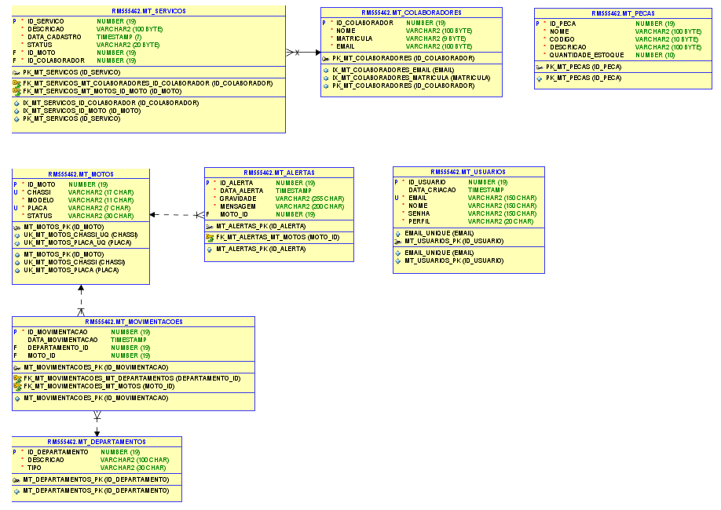
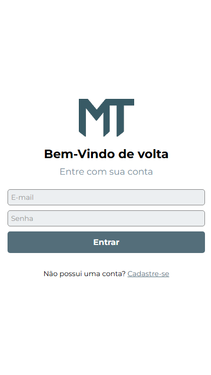
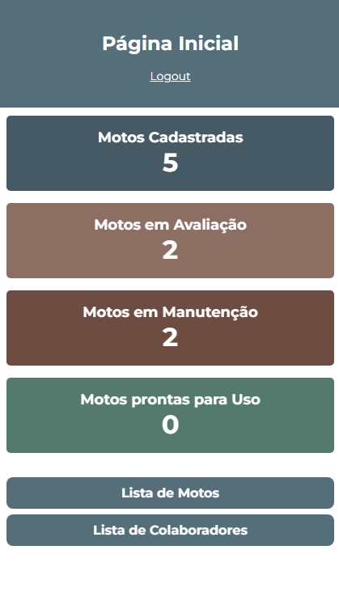
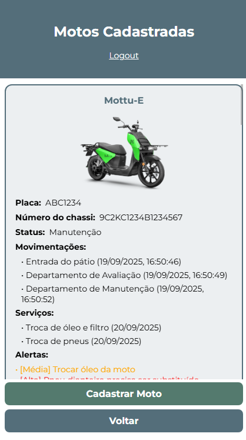
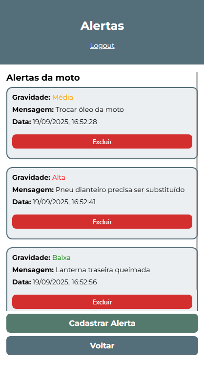
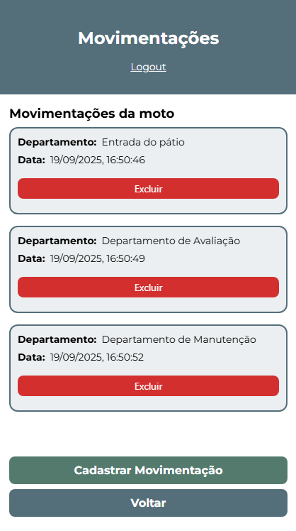
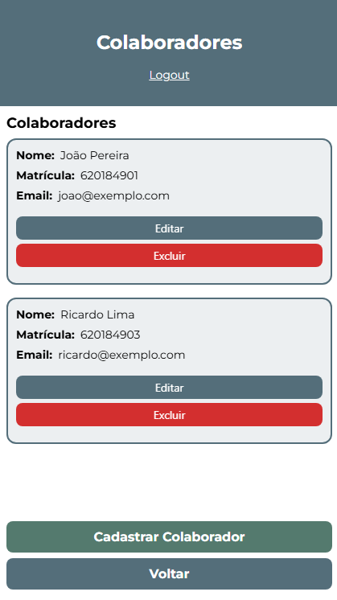
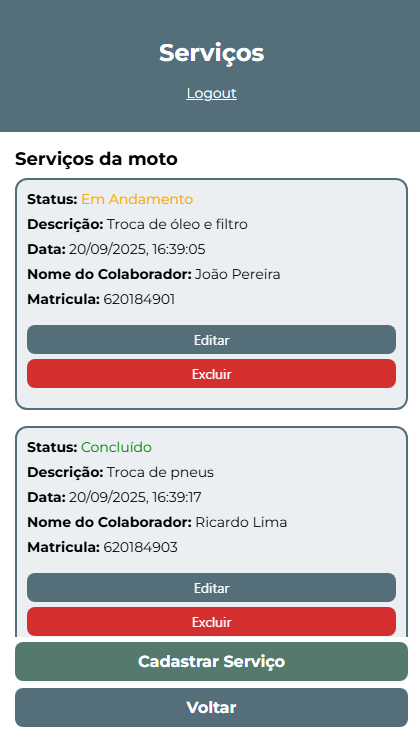

# 🏍️ MotoTrack - Frontend (Mobile)

## 👥 Integrantes

- **Felipe Ulson Sora** – RM555462 – [@felipesora](https://github.com/felipesora)
- **Augusto Lope Lyra** – RM558209 – [@lopeslyra10](https://github.com/lopeslyra10)
- **Vinicius Ribeiro Nery Costa** – RM559165 – [@ViniciusRibeiroNery](https://github.com/ViniciusRibeiroNery)

## 📌 Sumário

- [📝 Descrição da Solução](#-descrição-da-solução)  
- [🗄️ Modelagem do Banco de Dados](#️-modelagem-do-banco-de-dados)  
- [🚀 Como Rodar o Projeto MotoTrack Completo](#-como-rodar-o-projeto-mototrack-completo)  
- [📱 Detalhes do Projeto Mobile (React Native + Expo)](#-detalhes-do-projeto-mobile-react-native--expo)  
- [🚀 Como Rodar o Projeto Mobile (React Native + Expo)](#-como-rodar-o-projeto-mobile-react-native--expo)
- [🎨 Protótipo no Figma](#-protótipo-no-figma)
- [📹 Demonstração em Vídeo](#-demonstração-em-vídeo)
- [📦 Download do APK](#-download-do-apk)

## 📝 Descrição da Solução

O **MotoTrack** é um sistema completo desenvolvido para auxiliar empresas de aluguel de motos, como a Mottu, no **controle e monitoramento de sua frota**. 
A aplicação foi criada para resolver problemas comuns de gestão, como a desorganização nos pátios, dificuldade em localizar motos disponíveis ou em manutenção, 
e a falta de histórico rastreável de movimentações e serviços.

O sistema também oferece funcionalidades para **gerenciamento de serviços e manutenções**, vinculando cada atividade a um **colaborador responsável**
, além de permitir o **controle de estoque de peças**, garantindo reposição eficiente e visibilidade dos recursos da empresa.

### O sistema permite:
- 📝 **Cadastro e gestão de motos**;
- 🏢 **Organização por departamentos**, facilitando a localização de veículos;
- 🔄 **Controle de movimentações**, com histórico detalhado;
- 🛠️ **Gestão de serviços e manutenções**, vinculando responsáveis por cada atividade;
- 👨‍🔧 **Registro de colaboradores** envolvidos nos serviços;
- 📦 **Controle de estoque de peças**;
- 🚨 **Disparo de alertas** para acompanhamento do status das motos.

### Estrutura da Solução
O projeto foi dividido em múltiplos módulos para facilitar **escalabilidade e integração**, cada um com responsabilidades específicas:  

- ⚙️ **Backend REST em Java (Spring Boot)** – gerencia as entidades de **usuário, moto, movimentações e alertas**, utilizando **Spring Security com JWT** para autenticação e autorização.  
- 🖥️ **Backend MVC em Java (Spring MVC)** – oferece as mesmas entidades do backend REST Java, com um **frontend web bonito e funcional**, permitindo cadastro, edição, listagem e exclusão de dados diretamente pelo navegador. Possui **Spring Security** com validação de tipo de usuário (**Administrador** e **Comum**) para controlar o acesso às funcionalidades.
- 🧩 **Backend REST em .NET (ASP.NET Core)** – gerencia as entidades de **moto (somente leitura das tabelas criadas pelo Java), colaboradores, serviços e peças**, integrando funcionalidades complementares ao sistema.  
- 📱 **Frontend Mobile (React Native/Expo)** – consome ambas as APIs (Java e .NET) e disponibiliza **telas de cadastro, edição, exclusão e visualização** das funcionalidades, incluindo serviços, colaboradores e estoque de peças.  
- 🗄️ **Banco de Dados Oracle** – utilizado por todos os backends, com **criação automática de tabelas** ao iniciar os projetos.
- ☁️ **Cloud (Azure)** – responsável por hospedar o **Backend MVC Java** e o **banco de dados PostgreSQL**, utilizando **Azure App Service** para a aplicação e **Azure Database for PostgreSQL** para persistência. Essa camada garante **acessibilidade, escalabilidade e disponibilidade** do sistema em ambiente de nuvem. 

---

## 🗄️ Modelagem do Banco de Dados
Abaixo está a modelagem das tabelas utilizadas pelo sistema:  



---

## 🚀 Como Rodar o Projeto MotoTrack Completo

Para utilizar o **MotoTrack** de forma completa, é necessário rodar simultaneamente três módulos:

1. **⚙️ Backend API REST em Java (Spring Boot)** – fornece os endpoints REST para o sistema.
2. **🧩 Backend API REST em .NET (ASP.NET Core)** – fornece funcionalidades complementares via API.
3. **📱 Frontend Mobile (React Native/Expo)** – aplicação mobile que consome ambas as APIs e exibe todas as funcionalidades, incluindo serviços, colaboradores e estoque de peças.
>O **Backend MVC em Java (Spring MVC)** pode ser executado separadamente. Ele permite:
> - **📝 Login e cadastro de usuários;**
> - **🏍️ Cadastro, listagem, edição e exclusão de motos;**
> - **🔄 Cadastro, listagem e exclusão de movimentações e alertas.**

### 🛠️ Passo a Passo

1. Clone todos os repositórios:  
   - [API Rest Java](https://github.com/mototrack-challenge/mototrack-backend-rest-java)  
   - [API Rest .NET](https://github.com/mototrack-challenge/mototrack-backend-rest-dotnet)  
   - [Mobile](https://github.com/mototrack-challenge/mototrack-frontend-mobile)  
   - [MVC Java](https://github.com/mototrack-challenge/mototrack-backend-mvc-java)
   - [Cloud](https://github.com/mototrack-challenge/mototrack-cloud)

2. 🔌 Configure as credenciais de conexão com o banco Oracle nos arquivos de configuração dos backends, se necessário.
    - ✅ O banco de dados e as tabelas serão **criados automaticamente** ao iniciar os backends (Java REST, Java MVC e .NET)

3. 🚀 Rode os backends
    - Java REST: `mvn spring-boot:run` ou rode pelo IDE favorito 
    - .NET REST: `dotnet run` ou abra no Visual Studio

4. 📱 Rode o frontend mobile:
    - Navegue até a pasta do projeto e execute `npm install` para instalar dependências  
    - Execute `npx expo start` para abrir o app no emulador ou dispositivo físico

> ⚠️ Dica: primeiro inicie os backends para que o mobile consiga se conectar às APIs corretamente

5. 🖥️ Para testar o **MVC Java**, basta executar o projeto normalmente; ele funciona isoladamente, sem depender dos outros módulos

### ☁️ Opcional: Deploy em Cloud (Azure)

Também é possível executar o **MotoTrack MVC Java** diretamente na nuvem, utilizando **Azure App Service** e **Azure Database for PostgreSQL**.
- O passo a passo completo para realizar o deploy está descrito no repositório:  
  👉 [MotoTrack Cloud](https://github.com/mototrack-challenge/mototrack-cloud)

---

## 📱 Detalhes do Projeto Mobile (React Native + Expo)

O **MotoTrack Mobile** é o módulo frontend desenvolvido com **React Native e Expo**, responsável por fornecer acesso às funcionalidades do sistema de forma prática e intuitiva em dispositivos móveis.  
Ele consome os **endpoints das APIs Java e .NET**, permitindo gerenciar motos, movimentações, alertas, colaboradores e serviços diretamente pelo celular ou tablet.

> ⚠️ Para que o aplicativo funcione corretamente, é necessário que as **APIs Java (REST)** e **.NET** estejam rodando simultaneamente.

### 🛠️ Tecnologias e Dependências
O projeto utiliza as seguintes tecnologias e bibliotecas principais:  
- **React Native + Expo** – desenvolvimento do app multiplataforma (iOS e Android)  
- **React Navigation** – navegação entre telas  
- **Axios** – consumo de APIs REST   
- **Styled Components / Tailwind RN** – estilização das telas  

### 📝 Funcionalidades
O Mobile permite realizar operações de **visualização e CRUD** para diferentes entidades:  
- 🏍️ **Visualização de motos** (obtidas da API Java)  
- 🔄 **Movimentações e alertas de motos** (API Java)  
- 👨‍🔧 **Colaboradores** (API .NET)  
- 🛠️ **Serviços vinculados a motos e colaboradores** (API .NET)    

### 📸 Exemplos de Telas
1. **Tela de Login**  
   

2. **Tela Inicial**  
   

3. **Tela de Listagem de Motos**  
   

4. **Tela de Movimentações e Alertas**  
   

   

5. **Tela de Colaboradores**  
   

6. **Tela de Serviços**  
   

> ⚠️ Todas as telas foram desenvolvidas para serem **intuitivas, responsivas e consistentes**, garantindo uma boa experiência de usuário em dispositivos móveis.

--- 

## 🚀 Como Rodar o Projeto Mobile (React Native + Expo)

Para executar o **MotoTrack Mobile**, siga os passos abaixo:

> ⚠️ É necessário que as **APIs Java (REST)** e **.NET** estejam rodando simultaneamente para que o aplicativo funcione corretamente.

### 1️⃣ Instalar Dependências
- Abra o terminal na pasta do projeto mobile.
- Execute o comando para instalar todas as dependências do Node.js:

```bash
npm install
```

### 2️⃣ Iniciar o Projeto
- Após instalar as dependências, execute o comando:

```bash
npx expo start
```
- O Expo abrirá um **painel de controle no navegador** e gerará um **QR Code** para acesso pelo celular.

### 3️⃣ Executar no Dispositivo

- 📱 **Pelo celular:** Abra o aplicativo Expo Go (disponível para iOS e Android) e escaneie o QR Code exibido.
- 💻 **No navegador:** Clique no botão `W` no painel do Expo para abrir o projeto no web browser.

### 4️⃣ Navegação e Uso

- Após iniciar, você poderá acessar todas as funcionalidades do sistema:
  - 🏍️ Visualizar motos
  - 🔄 Criar, listar e deletar movimentações e alertas
  - 👨‍🔧 Gerenciar colaboradores
  - 🛠️ Gerenciar serviços
  - 📦 Consultar e atualizar estoque de peças

> Dica: Certifique-se de que as APIs estão rodando e acessíveis nos endereços corretos (`localhost:8080` para Java e `localhost:5073` para .NET) antes de iniciar o aplicativo mobile.

--- 

## 🎨 Protótipo no Figma

O design do **MotoTrack Mobile** foi planejado no **Figma**, garantindo uma interface moderna, responsiva e consistente entre as telas.  

👉 [Acesse o protótipo no Figma](https://www.figma.com/design/8i4XiCi16s1NIJUHwOXBH7/MotoTrack?node-id=0-1&p=f&t=uIOG5S4MyxRBTbXK-0)

> 💡 O protótipo apresenta o fluxo de navegação, cores, ícones e componentes utilizados na construção do aplicativo.

---

## 📹 Demonstração em Vídeo

Para ver o **MotoTrack MVC Java** em funcionamento, assista ao vídeo abaixo, onde o projeto é executado e suas principais funcionalidades são demonstradas:  

🎥 [Assista à demonstração completa](https://youtu.be/EDK2WOMBIRA)  

No vídeo, você verá:  
- Login e cadastro de usuários (admin e comum)  
- Cadastro, edição, listagem e exclusão de motos  
- Cadastro, listagem e exclusão de movimentações e alertas  
- Navegação pelas principais telas e funcionalidades do sistema
 
---

## 📦 Download do APK

Se preferir, você pode instalar o aplicativo diretamente no seu celular Android baixando o arquivo `.apk` já gerado:

👉 [Clique aqui para baixar o APK](https://expo.dev/artifacts/eas/jEMCGuR33Hq6c4ozKoehXJ.apk)

> ⚠️ Observação: pode ser necessário permitir a instalação de **apps de fontes desconhecidas** no seu dispositivo para concluir a instalação.
